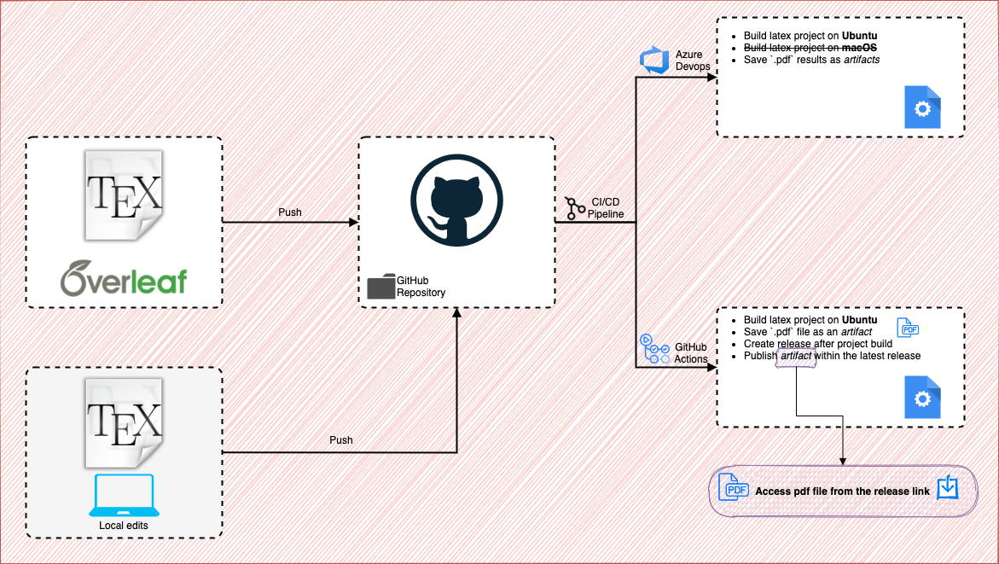

# Overleaf Book Template [CI/CD]

## CI/CD pipeline for a `Latex` project ⚙️

This repository contains a book template project in `Latex`. The codebase is integrated with GitHub Actions and Azure Pipelines (an [Azure DevOps](https://dev.azure.com/) service). Entire project workflow can be seen in the diagram shown below.

### GitHub Actions 🚀

After any changes to the latex project are being pushed (directly from Overleaf or from a local repo clone), the GitHub Action workflow will start. The pipeline will compile the latex project, obtain a `.pdf` file, then publish the file as a *release artifact*. Artifact will be available for direct download from a static [link](https://github.com/basavyr/Overleaf-Book-Template/releases/download/latest/main.pdf).

### Azure Pipelines 🚀

The `azure-pipelines.yml` file starts a workflow (triggers on any push done for the `main` branch) that will build the latex projects on two separate agent pools: Linux-Ubuntu and macOS. Both `.pdf` files that are generated after compilation is done will be published as artifacts. No release system implemented yet.

**TO-DOs**

* Implement release system for Azure CI/CD
 
### Author: Robert Poenaru

E-mail: `robert.poenaru@tutanota.de`
